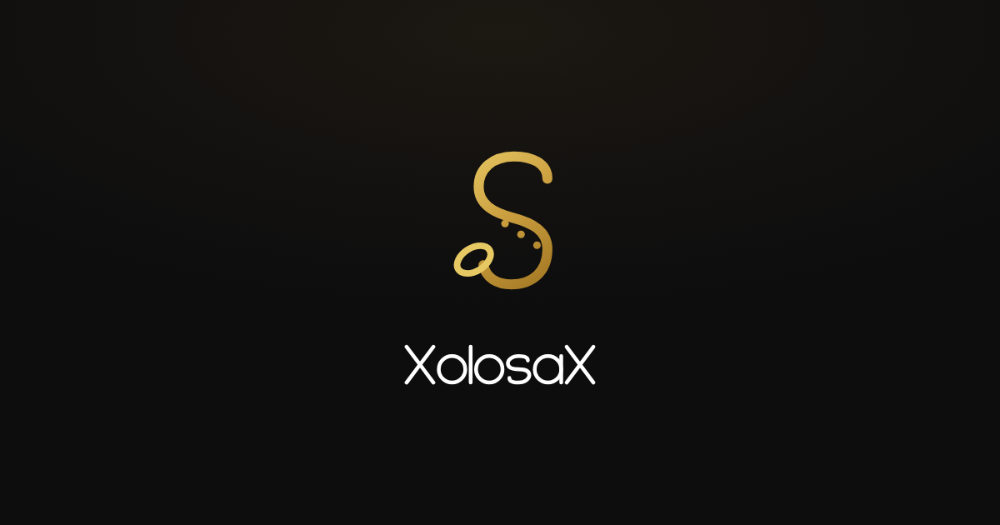
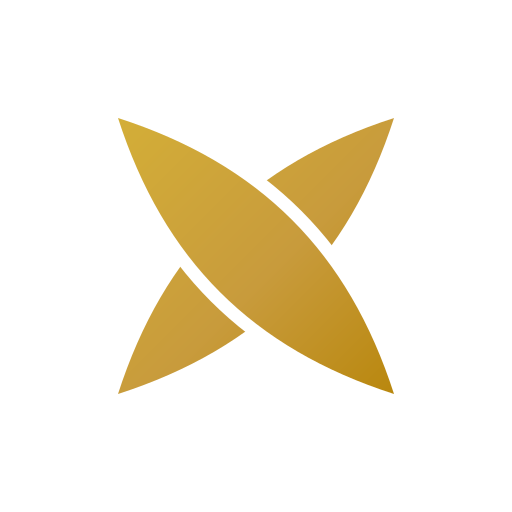
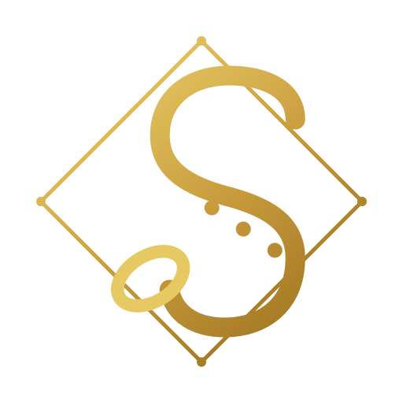
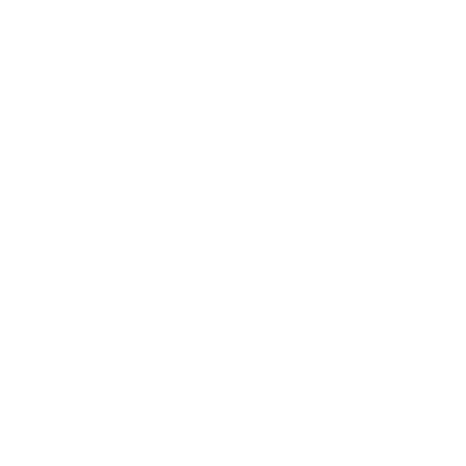
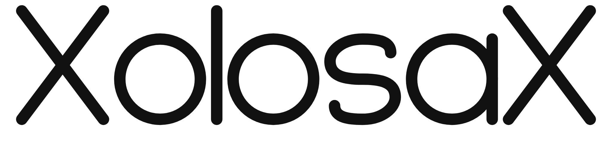

# XolosaX — Brand Identity System

> Music · Technology · Entrepreneurship · Artificial Intelligence



A premium identity for a creative visionary working at the intersection of musical
excellence, intelligent systems, and entrepreneurship. The system is built around a
single ownable symbol, a custom geometric wordmark, and a disciplined matte-black /
white / saxophone-gold palette. Everything is delivered as **vector SVG** so it scales
flawlessly from a 16 px favicon to a brushed-metal plaque, and works in monochrome,
gold foil, embossing, and engraving.

---

## 1. The Symbol — the *Golden S*

An elegant monoline **S** — the saxophone's own S-curve body. Its lower bowl opens into
an abstracted **bell mouth**, and a row of three key **pearls** runs down the body. The
mark can stand open, or be enclosed in a fine **diamond seal** whose diagonals and four
points trace the **X** of XolosaX — turning the monogram into a crest.

This direction is synthesised from four reference logos the founder selected: a minimal
gold S, a saxophone-as-S with key pearls, an ornate sax-and-S monogram, and a diamond
emblem. The best of each is distilled into one refined, ownable mark.

The meaning is hidden in the geometry rather than illustrated:

| Read | Meaning |
|------|---------|
| The **S** | The saxophone's S-curve; the heart of *XoloSaX* |
| The **bell** + three **pearls** | Saxophone craft — a cue, never a literal horn |
| The **diamond seal** & its four points | The **X…X** bookends; a crest / stamp of quality |
| Slim **monoline**, gold gradient | Lacquered brass, Swiss restraint, premium calm |

<p>
  
  
  
</p>

**Files** (`symbol/`)

| File | Use |
|------|-----|
| `xolosax-symbol-gold.svg` | Primary open S — champagne→brass gradient |
| `xolosax-symbol-gold-flat.svg` | Single-colour gold open S (print / spot) |
| `xolosax-symbol-black.svg` / `-white.svg` | Mono open S for light / dark & knockout |
| `xolosax-seal-gold.svg` | Diamond **seal** (crest) — gradient |
| `xolosax-seal-black.svg` / `seal-white.svg` | Mono seal for stamps, foil, engraving |
| `xolosax-symbol-*-mini.svg` | Pearl-less, heavier S for very small sizes & deep engraving |

> **Small-size rule:** below ~24 px use the **mini** variant (pearls dropped, stroke
> heavier) so the S stays crisp. The favicon already uses it. Reserve the detailed **seal**
> for sizes above ~48 px.

---

## 2. The Wordmark

A **custom geometric monoline** wordmark — circular `o`s, even tracking, the two capital
`X` bookends framing the lowercase `olosa`. Light weight and open spacing give it an
editorial, luxury register. It is drawn as outlined vector paths, so it carries **no font
dependency**.



**Files** (`wordmark/`): `-black`, `-white`, `-gold`.

---

## 3. Lockups

Pre-composed symbol + wordmark combinations with correct proportion and clear space
already built in (`lockup/`).

| File | Orientation / colour |
|------|----------------------|
| `xolosax-lockup-horizontal-dark.svg` | Symbol + black wordmark, transparent |
| `xolosax-lockup-horizontal-reversed.svg` | Gold symbol + white wordmark, transparent (for dark) |
| `xolosax-lockup-horizontal-gold-on-dark.svg` | Boxed dark card |
| `xolosax-lockup-horizontal-mono-black.svg` | Single-colour black |
| `xolosax-lockup-vertical-*` | Stacked variants (dark / reversed / mono / boxed) |

Use **horizontal** for headers, signatures, and plaques; **vertical** for app splash,
profiles, programmes, and avatars.

---

## 4. App icon & favicon

- `app-icon/xolosax-app-icon.svg` — 1024 squircle, gold mark on a black gradient field.
- `favicon/xolosax-favicon.svg` — 64 px rounded tile using the solid mark for legibility.
- Raster exports in `png/`: app icon `1024`, favicon `180 / 32 / 16`.

---

## 5. Colour

| Role | Name | HEX |
|------|------|-----|
| Primary | Matte Black | `#111111` |
| Primary | White | `#FFFFFF` |
| **Signature** | **Saxophone Gold** | **`#C89B3C`** |
| Accent | Rich Brass Gold | `#B8860B` |
| Accent | Champagne Gold | `#D4AF37` |
| Optional | Deep Navy | `#0F172A` |

The gradient used in the gold mark runs **Champagne → Saxophone Gold → Brass**
(`#D4AF37 → #C89B3C → #B8860B`) along the descending diagonal, evoking lacquered brass.
For print, foil, embossing and engraving, use the **flat** gold or a single metallic ink.

---

## 6. Clear space & minimum size

- **Clear space:** keep a margin of at least the height of one symbol arm-tip (≈ 20% of
  the mark) on all sides. The lockup files already include this padding.
- **Minimum size:** symbol 16 px (solid variant); wordmark 90 px wide; lockup 120 px wide.

---

## 7. Do & Don't

**Do** — use the supplied gold, keep generous clear space, place on matte black, white,
navy, or gold foil, and use the solid mark when tiny.

**Don't** — recolour the gold, add drop shadows or extra gradients, stretch or rotate the
mark, outline the wordmark, or place the gold mark on busy/low-contrast imagery.

---

## 8. Regenerating the assets

All artwork is generated from precise geometry (no font or external dependency for the
vectors themselves). Source in `src/`:

```bash
cd brand/src
node build.mjs        # regenerates every SVG in symbol/ wordmark/ lockup/ app-icon/ favicon/

# Optional preview / PNG export (needs playwright-core + the bundled Chromium):
npm i playwright-core
node export.mjs        # writes png/ rasters + banner
```

- `symbol.mjs` — the Golden S geometry (`symbol({color, gradient, frame, pearls, bell, sw})`)
- `wordmark.mjs` — the geometric letterforms (`wordmark({color, track})`)
- `build.mjs` — emits the full file set · `render.mjs` / `export.mjs` — preview & raster

---

See **`showcase.html`** for the full identity presentation and application mockups
(business card, app icon, website header, embossed seal, apparel, metal plaque).
